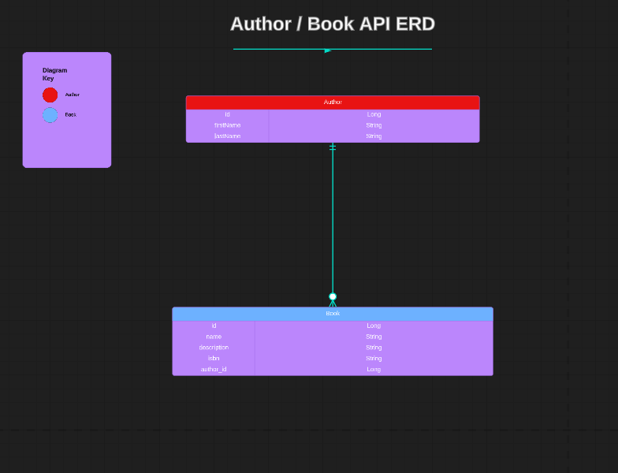

# Library API 

A Library API for book enthusiasts, librarians, and bibliophiles. The API provides a comprehensive platform for managing authors, allowing users to search for all or individual authors, add new authors, update author information, and remove authors from the database. Users can also effortlessly manage books, with the ability to search for all books in the library, or search for, add, edit, and delete books authored by a specific writer. The API also offers powerful search capabilities, enabling users to find books and authors quickly and effectively.

## Technologies Used

* Java 17
* Maven 
* Spring Boot
* Spring Data (JPA)
* H2 Database
* Postman 
* Apache Tomcat 
* MockMVC 
* Cucumber with Rest Assured 
* IntelliJ 

## General Approach

I started off by creating my user stories and acceptance criteria. This helped me visualize my end goals and outline what I wanted to achieve with this project. I also created a spreadsheet of all my HTTP methods and endpoints to keep track of which methods were supposed to hit which endpoint.

Finally, I created an ERD (entity relationship diagram) to plan my different models and their relevant attributes. This helped me to visualize their relationships to one another and plan out how I was going to link the corresponding tables in the database.

## Entity Relationship Diagram 

## User Stories 

<b>User Story 1:</b>
 
As a user, I want to be able to search for different books so that I can discover new books to read. (GET all books)

<b>Acceptance Criteria:</b>
 
* User can search for all books written by all authors.
* Search results should display a list of all books.

<b>User Story 2:</b>
 
As a user, I want to be able to search for specific books so that I can look up its information (title/name, description, ISBN, and author). (GET individual book by author ID & book ID)

<b>Acceptance Criteria:</b>
 
* User can filter search results by author & book.
* Search results should return an exact match to the user's search criteria.

<b>User Story 3:</b>
 
As a user, I want to create a book so that I can save it to its corresponding author’s book list. (POST book to author)

<b>Acceptance Criteria:</b>
 
* User can create new books.
* User can save specific books to specific authors.

<b>User Story 4:</b>
 
As a user, I want to edit a book so that I can update its information saved in its corresponding author’s book list. (PUT book to author)

<b>Acceptance Criteria:</b>
 
* User can edit/update books.
* User can save updated information for specific books written by specific authors.

<b>User Story 5:</b>
 
As a user, I want to delete a book so that I can delete it from its corresponding author’s book list. (DELETE book from author)

<b>Acceptance Criteria:</b>
 
* User can delete books.
* User can delete specific books from its author’s book list.

## HTTP Endpoints

| Request Type | URL                     | Functionality                         | Access | 
|--------------|-------------------------|---------------------------------------|--------|
| POST         | /api/authors/           | Create author                         | Public |
| GET          | /api/authors/           | Get all authors                       | Public |
| GET          | /api/authors/1/         | Get single author                     | Public |
| PUT          | /api/authors/1/         | Update single author                  | Public |
| DELETE       | /api/authors/1/         | Delete single author                  | Public |
| POST         | /api/authors/1/books/   | Creating a book for a single author   | Public |
| GET          | /api/authors/books/     | Get all books                         | Public |
| GET          | /api/authors/1/books/1/ | Get a book belongs a single author    | Public |
| PUT          | /api/authors/1/books/1/ | Update a book belongs a single author | Public |
| DELETE       | /api/authors/1/books/1/ | Delete a book belongs a single author | Public |

## Major Hurdles

When writing the tests for my Controller and Service classes, I was able to get all tests to pass for the author model in both MockMVC and Cucumber, but wasn't able to get the tests to pass for the book model. The problem lies in the tests because all of the endpoints work, so I know it's just a matter of me doing more research into how to refactor the test code for a model that depends on another one. I do plan on doing so in the future. 

### Links
* User Stories - https://docs.google.com/document/d/11ErHb1ri7wEwRrzjHauND4Lx_o0dUNj1r50fQJGNSjA/edit?usp=sharing

* HTTP requests/endpoints spreadsheet - https://docs.google.com/spreadsheets/d/1AIwIA3782Ur-iYnd46RNwIqCRZIES8KVdxtaafoxSLw/edit?usp=sharing 

### Special Thanks

* Suresh Sigera - my instructor who taught me all the concepts used in this project. 
* [GitHub](https://github.com/sureshmelvinsigera) 

### Author

:woman_technologist: Erica Ayala

* [LinkedIn](https://www.linkedin.com/in/ayalavirtual)

* [GitHub](https://www.github.com/AyalaVirtual) 

